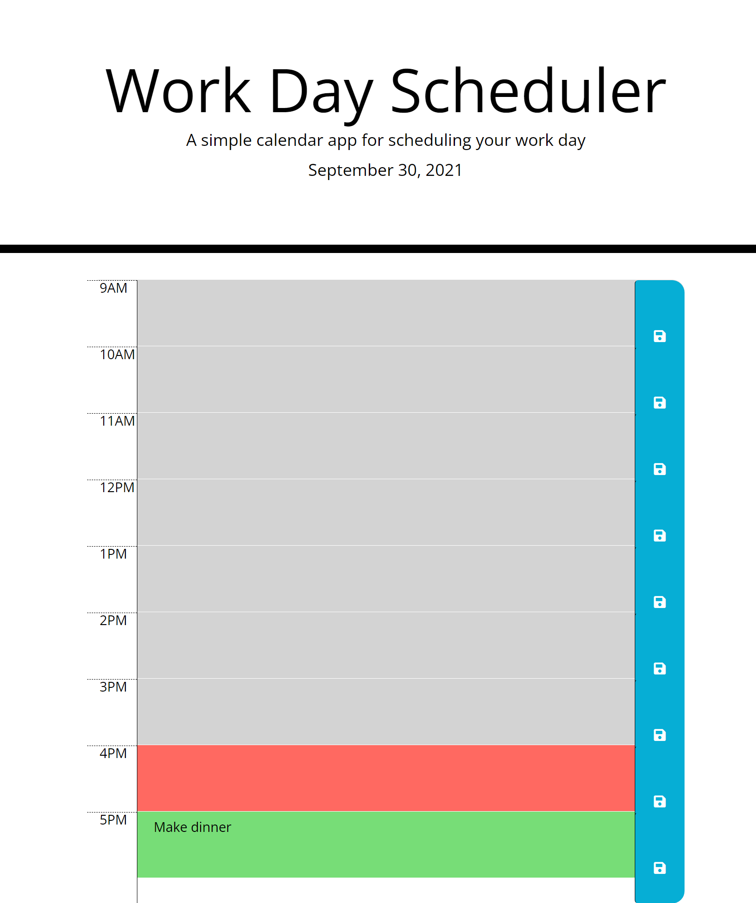

# Work Day Scheduler

### Useage

This work day planner allows the user to not only schedule tasks during normal business hours, but also allows the user to see whether a time block is in the past, present, or future. Each task is saved to local storage so the task is not lost upon refreshing the page. If a time block is in the past, it will be color coded as grey, if it is the current hour, it will be red, and if it is in the future, it will be green. 

Access this planner via this link: https://ericaleesnyder.github.io/work-day-scheduler/

### Features

The applicaiton displays the current date in the header. Each hour from 9:00 AM - 5:00 PM has a text area in which the user can schedule tasks. In order to save the task, the user need only click the save button immediately to the right of their current hour block. 

### Planner with task scheduled: 
